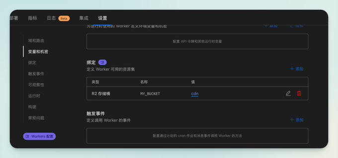
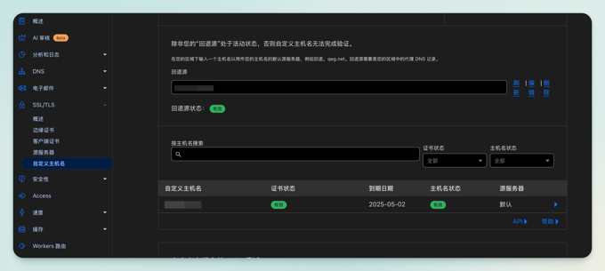

<script setup>
import {onMounted} from "vue";

const emits = defineEmits(["syncMeta"]);

onMounted(()=>{
    emits("syncMeta", frontmatter);
    
})
</script>

# 在中国使用 Cloudflare R2 服务的正确方式之一（2025.3) {#title .arco-typography}

Cloudflare有一个存储服务名为R2对象存储；大名鼎鼎。网上不乏介绍怎么使用这个服务作为图床的，然而都没正视一个问题：使用R2的一般操作方式是将主域（R2会用到的自定义域）托管到Cloudflare并由其全权代理（DNS配置已代理；云朵图标亮起），不能修改R2自定义域的解析参数。Cloudflare分配给R2的IP是不固定的，
即使R2的位置选择在亚太地区 (APAC)，也会可能被分配到在中国无法正常访问的IP，这就导致相应服务可用性大大降低。

## 1. 解决方案的整体思路 {#1 .arco-typography}

Cloudflare在其官方渠道曾经有过说明，中国的互联网由于三大运营商分而治之又相互合作，因此我国的网络设置环境较为复杂。因此R2分配的IP无法访问有可能是在其中
某两家运营商正常，而另外一家不可用的情况（实际上按线路的话情况更复杂，因为不止就三大运营商的线路）。这种情况并不罕见，于是国内的DNS服务商你能看到按线路解析的特色产品，
一年交点钱（因为一般得买个套餐才给你这个功能用）能够让你设置DNS解析时，根据客户端所处的运营商线路，来编排响应路径。这个产品恰好符合R2服务在部分区域
网络不可用时，我们能灵活更换DNS解析的需求。或者再一开始，我们就讲DNS解析按照境内、外的访问来源区分解析，对于境外来源访问直接回源到R2，对于境内的访问则解析
一个高可用的IP上，如果出现问题可以立时更换这个IP。

这样，我们就引出这么几个问题：

- 这个所谓高可用IP从何而来？
- 这个IP如果存在是如何访问到自己的R2服务的？
- 如果能访问，这样看起来绕路的方案让Cloudflare最具优势的缓存策略服务如何生效？

下面我们来依次研究解决这些问题。

## 2. 部署Cloudflare的边缘计算服务Workers {#2 .arco-typography}

### 2.1 产品简介

Workers是Cloudflare退出的边缘计算产品，以构建和部署无服务器功能、站点和全栈应用程序。

这个产品国内几大云服务厂商都有，不是什么新鲜玩意。本质上就是一个代码（函数）片段就能直接跑起来一个应用的功能，免去各种运维层面的环境配置和本地编译环节等。当然各家
包括Cloudflare都有围绕这个核心本质延伸出很多其他功能特性，这里按下不表。由于Workers是边缘计算，这就是说在Cloudflare的任意节点，都可以响应部署在Workers中的算法。
而正如前述，Workers显然和Cloudflare的其他服务比如R2可以搭配使用。

另一方面，这就意味着受控的主域指向任意Cloudflare的节点IP时，都能够通达到我们在Workers中部署的算法，如果这个算法再能够访问到R2，那么我们便解决了第2个问题。

产品文档地址：https://developers.cloudflare.com/workers/

### 2.2 第1个问题：这个所谓高可用IP从何而来？

但是我们还是得解决第1个问题。

Cloudflare在其官网有公布自有IP段，当中可用的IP地址都是所谓节点。网上查到的所谓「优选IP」即基于此。这是方式之一；也就是DNS可以解析到当中的任意IP。
但是这个IP并不高可用，不然就用不着去费尽心思优选了。主要原因是Cloudflare会调度当中的IP资源，并且不会事先通知你，进而会导致你选用的IP开始是好好的，突然会不行了。

于是有方式二，Cloudflare推出了一个DNS解析器产品，文档地址：https://www.cloudflare-cn.com/learning/dns/what-is-1.1.1.1/
就是说，由于这是一个DNS解析器，那就得高可用。除了1.1.1.1以外，还有1.0.0.1等，我们可以解析到这些IP上，因为他们也算Cloudflare的节点。但是：

- 1.1.1.1 不建议使用。因为运营商层面可能使用这个地址作他途。建议用别的。
- 解析器的这些节点Cloudflare作了校验，目前的策略是你需要确保域下有一个验证解析会始终存在让Cloudflare可以核实（后面说到）。
- 这些节点访问速度可能不理想。

综上，两类IP任君选择，我建议你动手的时候自己去验证，再根据实验结果选择。至此，我们解决了第1个问题。

**_2025-06 更新：
由于Cloudflare更改了产品策略并生效，导致1.1.1.1 和 1.0.0.1 已经不能用，取而代之的方法是用「优选IP」。这个所谓的优选IP可以通过网络搜索到。_**

### 2.3 配置Workers以集成R2服务

如何开通产品不是本文重点故略去不表，仅就关键配置操作说明如下。

**绑定R2服务**

在下图所示` 变量和机密 - 绑定` 功能里，将R2绑定。

点击绑定区域的 `+添加` 按钮，之前如果你已经开通了R2，这里能够选择到对应的存储桶。此处的 `名称`
按你喜好取，符合命名语法规范即可。后续代码片段里会用到此处的名称。



**配置Workers函数**

官方的产品文档里有说明如何配置以使得Workers可以调用R2的资源，但那个例子稍显繁琐，我这里简化如下。

这里仅有两点需要强调：

- 注意代码里的 **MY_BUCKET** 就是上一步你取的名字。
- 注意从R2取对象的算法中，配置项 `onlyIf: request.headers` 这段至关重要。

关于上面第2点，我还需要再强调并实际上是想说明一个至关重要的意识：碰到问题第一优先是去查阅官方的一手资料，而不是网上的比如我这种二手资料。
关于这个配置项官方的例子里已经是提到的，并且有相应的文档具体解释，然而你会发现类似Workers+R2的教程资料或通过 `headers.set("ETag", object.httpEtag);` 
这段代码作为关键词能够查询到的文章里，少有第2点提到的配置。

`headers.set("ETag", object.httpEtag);`  是指在响应的报文里增加 Etag 头信息，这个详解自查；大体作用是现代浏览器缓存策略的一种识别手段。
需要配合后端服务一并起效。问题就在于，诸多教程都教写这段并且还有  `const status = object.body ? (request.headers.get("range") !== null ? 206 : 200) : 304` ，
然而没有上述第2点的配合，你测试时会发现无论何种情况都拿不到 304 的响应结果；也就是缓存始终不起效。碰到半吊子还让你去主域 Cache Rules 那乱搞一通，实际上没卵用。

这里，就解决了问题3。

```javascript {.line-numbers .match-braces .rainbow-braces}
function objectNotFound(objectName) {
    // 使用模板字符串但转义HTML标签
    const htmlContent = `Object "<b>${objectName}</b>" not found.`;
    return new Response(htmlContent, {
        status: 404,
        headers: {
            'content-type': 'text/html; charset=UTF-8'
        }
    })
}

export default {
    async fetch(request, env) {
        if (request.method !== "GET") {
            return new Response("Only GET method allowed", {status: 405});
        }
        const url = new URL(request.url);
        const objectName = url.pathname.slice(1);
        const object = await env.MY_BUCKET.get(objectName, {
            range: request.headers,
            onlyIf: request.headers,
        })
        if (object === null) {
            return objectNotFound(objectName);
        }
        const headers = new Headers();
        object.writeHttpMetadata(headers);
        headers.set("ETag", object.httpEtag);
        if (object.range) {
            headers.set("content-range", `bytes ${object.range.offset}-${object.range.end ?? object.size - 1}/${object.size}`)
        }
        const status = object.body ? (request.headers.get("range") !== null ? 206 : 200) : 304
        return new Response(object.body, {
            headers,
            status
        });
    }
};
```

**配置Workers路由**

此时这个配置有2个入口：
- 位于主域管理界面下有名为 **Workers 路由** 的菜单里配置。
- 位于上图Workers界面里的 **域和路由** 里配置。

在任一侧配置另一边都会同步，所以本质上是一个功能的2个入口。

这里配置的域名是指访问Workers服务并运行上述代码的域名。这个域名不能托管到Cloudflare。

下面讲怎么处理。

## 3. 域名的配置 {#3 .arco-typography}
### 3.1 准备2个域名
你需要准备2套主域名，或将1套主域名中某个子域分出去单独作NS解析。所以本质上就是要2套NS解析的域名，其中1套不能托管在Cloudflare。

比方说你有www.a.com和www.b.com这样2套域名（下简称A、B），A和B均托管到Cloudflare，拿A去指向边缘节点再去访问B名下的R2服务会报错。
原因你感兴趣可以详查，这不是本文重点。同样的道理，A你分一套子域a这样玩也行不通。

考虑存储服务或者CDN服务的域名，一般实践建议与网站的域名分开以避开浏览器并发域名限制等问题，所以这里我们假设 **A是网站的域名，B是用来作R2的域名**。

现在，你需要将A完全托管到Cloudflare，B则托管到国内云服务商以利用我前述按线路解析的功能。

### 3.2 配置A
Cloudflare的引导是做的不错的，再说网上相关教程多如牛毛，所以略去如何将A托管过来的细节。这里只说下关键要点。
- A域名下访问网站的解析，如果是指向备案的网站不要走Cloudflare代理；也就是仅 DNS（云朵图案不亮）。否则会引起备案失效。
- 分配一个A的子域，当作R2的自定义域名。这个域名会被Cloudflare强制代理，你会在DNS记录里看到这个子域是已代理状态（云朵图案亮起）。

### 3.3 配置B
一样略去域名注册这些细节，关键要点如下。
- 将B的中国地区来源解析到前述的高可用IP上。
- 将B的境外来源解析到A分配给R2的那个子域名上（注意是CNAME解析）。
- 在A的主域设置界面，找到自定义主机名位置（下图），将回退源设置到A分配给R2的子域，将自定义主机名设置成B。
- 前述在配置Workers路由里，配置的域名是这里的B。
Cloudflare会安排你做一系列设置来验证你对B的所有权，本质就是在B那按照Cloudflare界面给出的解析记录配置几条解析。

请注意上述一旦配置不要修改，也不要删除。Cloudflare会定期检查这些配置的有效性，包括那个B指向A的CNAME解析也不能动。



到这里，就解决了问题2。

## 4. 总结 {#4 .arco-typography}
经过以上配置，客户端访问R2服务时，服务链路大体是这样的：

B -> Cloudflare节点 -> 回源A主域（发现路由到Workers） -> Workers -> R2。

这么一看自是很绕，这是因为：
- B能够访问Cloudflare节点并启用HTTPS服务，需要通过自定义主机名和回源服务来实现。
- 让B直接回源到R2也就是A分配给R2的那个自定义域上，其实是将B通过CNAME解析到R2绑定的A的子域名，于是你绕不过一开始我说的IP不可用问题。
- Workers是边缘计算，你可以简单的理解为他是在你指向的IP上跑的服务，你指向的IP是通达的于是这个服务能跑，至于这个服务与R2的通信是Cloudflare内部处理的，
于是就不成问题。而Workers的路由配置优先级高于回源到R2的设置，于是访问被路由到Workers，然后再到R2。